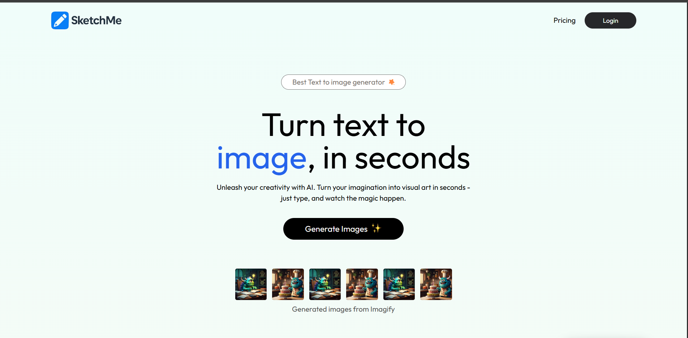
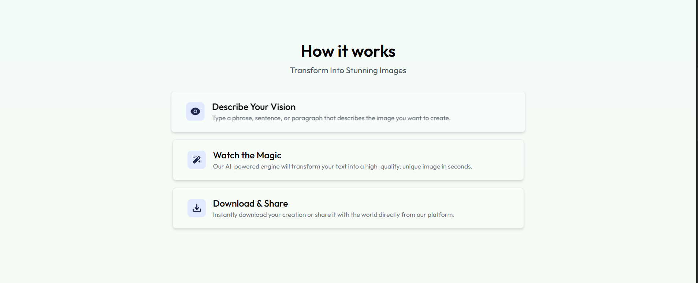

# 🎨 SketchMe – AI Text-to-Image Generator (MERN Stack)

SketchMe is a full-stack web application that turns your imagination into art. Just enter a text prompt like *"a sunset over a futuristic city"* and SketchMe will generate a matching image using powerful AI. It features a smooth UI, user authentication, payment integration, and image history.

## 🚀 Features

- ✍️ **Text-to-Image AI** using [CLIPDrop API](https://clipdrop.co/)
- 🔒 **JWT Authentication** for secure login/register
- 🖼️ **User Prompt & Image History** stored in MongoDB
- 💳 **Razorpay Integration** for premium image downloads
- 🌈 **Responsive UI** with Tailwind CSS & Framer Motion
- ⚙️ Built with the **MERN Stack** (MongoDB, Express, React, Node.js)

---

## 🧠 Why SketchMe?

Not everyone knows how to design, but everyone has imagination. SketchMe is designed to be your creative assistant — turning ideas into visuals with one line of text.

Whether you're a:
- 💡 Creator looking for inspiration
- 📚 Student creating visuals for projects
- 🤖 AI enthusiast exploring generative models

SketchMe makes it fun and easy!

---

## 🏗️ Tech Stack

| Technology     | Purpose                              |
|----------------|--------------------------------------|
| React.js       | Frontend UI                          |
| Tailwind CSS   | Styling and layout                   |
| Framer Motion  | Animations and transitions           |
| Node.js        | Backend runtime                      |
| Express.js     | REST API backend                     |
| MongoDB        | Database for users & history         |
| JWT            | Secure login authentication          |
| CLIPDrop API   | AI image generation from text prompts|
| Razorpay       | Payment gateway for premium downloads|

---

## 📷 Preview





---

## ✨ Features in Detail

### 1. Image Generation
- Users enter a prompt and click "Generate"
- The backend sends this prompt to CLIPDrop API
- AI responds with an image, which is displayed in real-time

### 2. Authentication
- Users can register and log in securely using JWT
- Login token is stored in localStorage and used for protected routes
- Premium content is available only to logged-in users

### 3. Razorpay Integration
- Users can buy high-resolution, watermark-free downloads
- After payment, the download is unlocked
- Backend validates payment using Razorpay’s webhook system

### 4. User Dashboard
- Logged-in users can view past generations
- Saved images and prompts are listed from MongoDB

---

## 🛠️ Installation & Setup

### 1. Clone the repo
```bash
git clone https://github.com/KaranOps/SketchMe.git
cd SketchMe
```
### 2. Setup Backend
```bash
cd server
npm install
# Create a .env file and add the following:
# PORT=5000
# MONGO_URI=your_mongo_connection_string
# JWT_SECRET=your_jwt_secret
# CLIPDROP_API_KEY=your_clipdrop_key
# RAZORPAY_KEY_ID=your_razorpay_key_id
# RAZORPAY_KEY_SECRET=your_razorpay_secret
npm run dev
```

### 3. Setup Frontend
```bash
cd ../client
npm install
# Create a .env file and add:
# VITE_SERVER_URL=http://localhost:5000
npm run dev
```

## 🙋 About Me

Hi! I’m **Karan** 👋 — a full-stack developer passionate about **AI**, **creativity tools**, and building solutions that solve real-world problems.

Let’s connect on [LinkedIn](https://www.linkedin.com/in/karanops93) or check out more of my work on [GitHub](https://github.com/KaranOps).

---

Made with ❤️ using **AI & imagination**.
